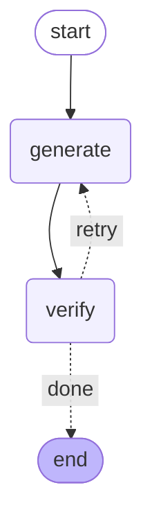

# Critic loop (generated)

Generated from the compiled LangGraph by `python -m scripts.export_graph`; do not edit by hand.

```mermaid
graph TD;
	__start__([start]):::first
	generate(generate)
	verify(verify)
	__end__([end]):::last
	__start__ --> generate;
	generate --> verify;
	verify -. &nbsp;done&nbsp; .-> __end__;
	verify -. &nbsp;retry&nbsp; .-> generate;
	classDef default fill:#f2f0ff,line-height:1.2
	classDef first fill-opacity:0
	classDef last fill:#bfb6fc
```
